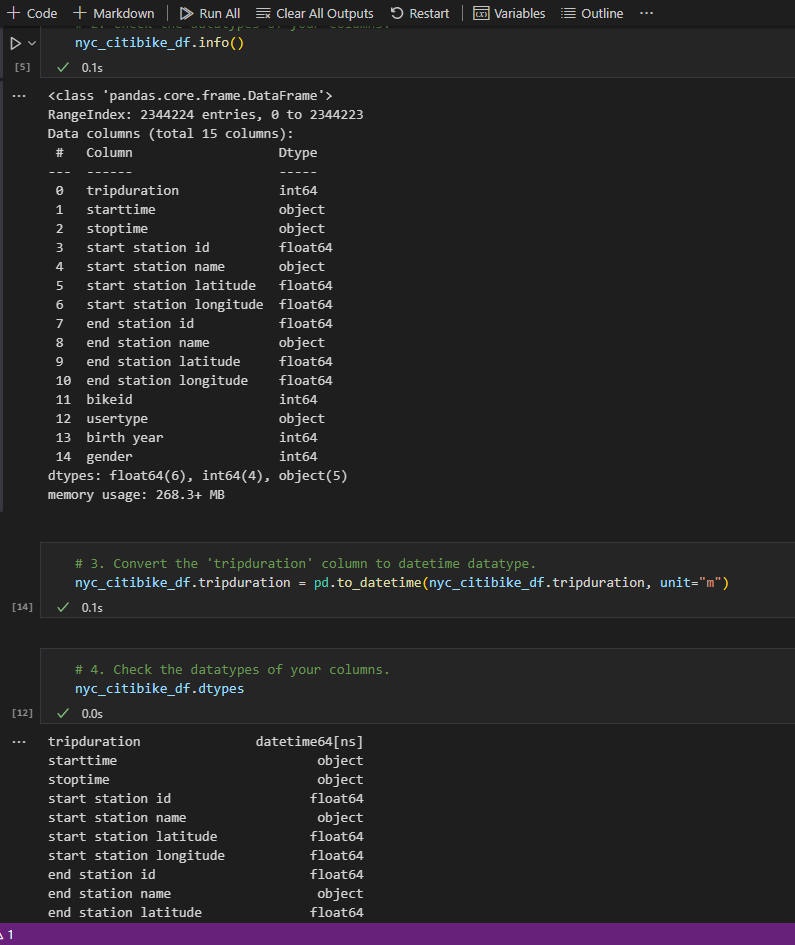
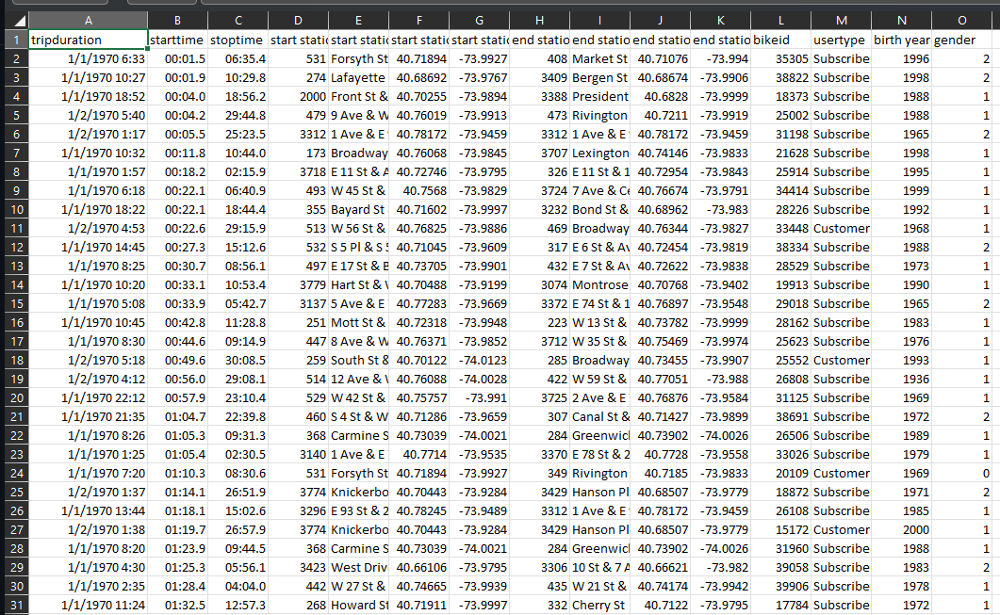
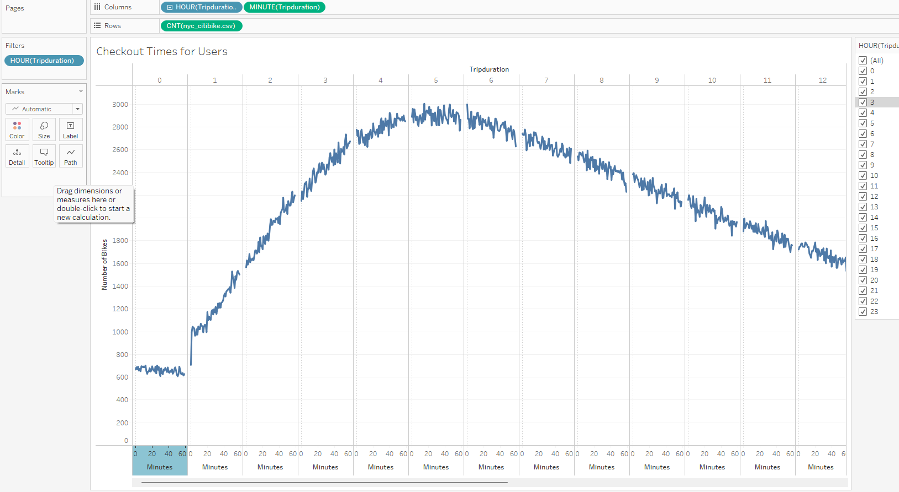
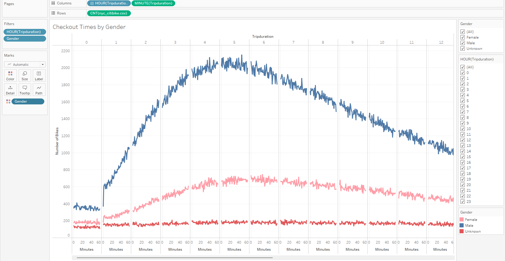
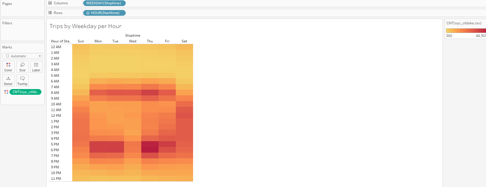
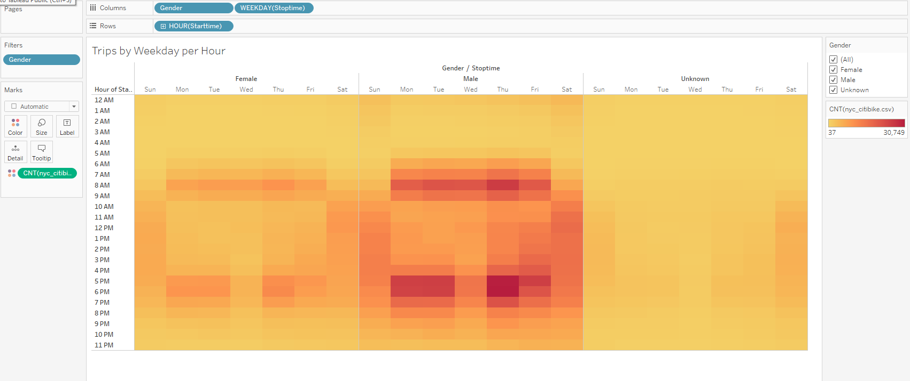
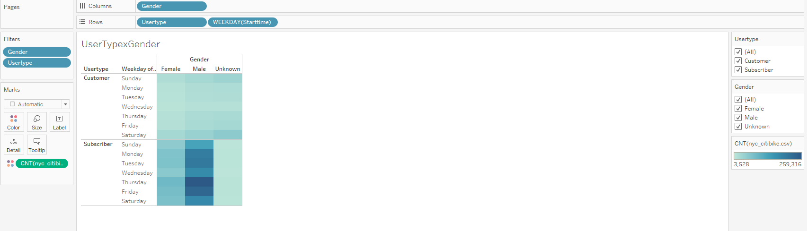
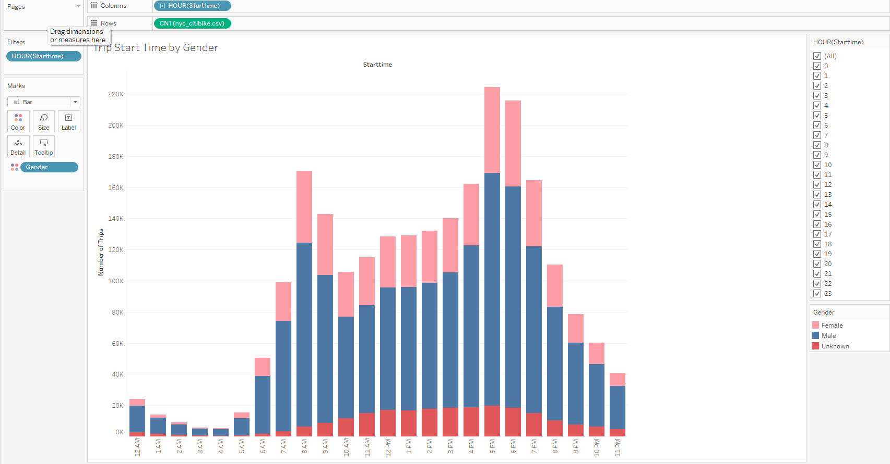
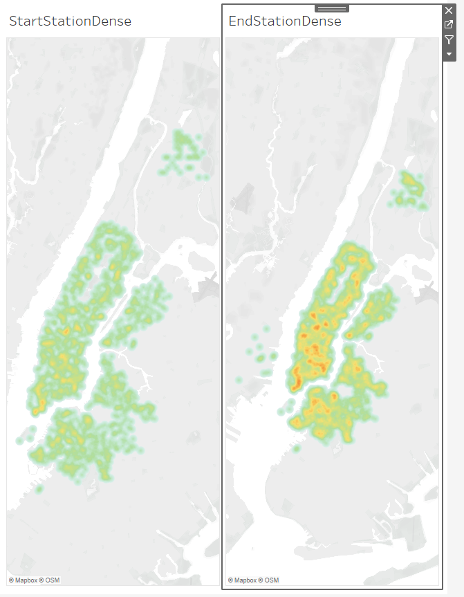

# NYC_Citibike_Challenge
Using Tableau to Visualize the data from NYC's Citibike program

## Purpose
Now that we've gotten a good idea of how to create our story, there is still some more work to be done to convince investors that a bike-sharing program in Des Moines is a solid business proposal. To solidify the proposal, one of the key stakeholders would like to see a bike trip analysis.

For this analysis, you’ll use Pandas to change the "tripduration" column from an integer to a datetime datatype. Then, using the converted datatype, you’ll create a set of visualizations to:

    Show the length of time that bikes are checked out for all riders and genders
    Show the number of bike trips for all riders and genders for each hour of each day of the week
    Show the number of bike trips for each type of user and gender for each day of the week.

Finally, you’ll add these new visualizations to the two you created in this module for your final presentation and analysis to pitch to investors.

## Link to Tableau Story
[NYC Citibike Story](https://public.tableau.com/views/Citibike_Challenge_16828849721440/StartsandEnds?:language=en-US&:display_count=n&:origin=viz_share_link)

## Data Cleaning
Before we began the data analysis it was imperative to clean up some of the data, particularly the trip duration column which needed to be changed from an integer to a datatime format using Pandas Dataframes.

To ensure the raw data contained the data the way we wanted it we checked the .csv

## Data Analysis
Through the use of Tableau it became clear that most of the Citibike's users were men and that the most popular time of the day to ride was through the weekday during the typic start times for 8 hours shift work. This trend was identified in both men and women. Mapping the data on Manhattan showed the while most trips begin in Lower Manhattan, there are a not insignificant portion of rides that end on the across the Hudson river in New Jersey.

### First Analysis: Checkout Times for Users

We can see that most trips land in the 3-9 hour ranges showing that people have a tendency to use the bikes for longer trips rather than short.

### Second Analysis: Checkout Times by Gender

In this graph we can see that that ride times for women is flat, while for men it curves upward significantly from 3 to 8 hours.

### Third Analysis: Trips/Hour by Weekday

With this heatmap we see that 8AM and 5PM are the most popular time for Citibike trips with a dip midday during the week. However, this trip is the opposite on the weekend when 10AM to 4PM show the most popularity. Likely due to the 9 to 5 workweek. 

### Fourth Analysis: Trips/Hour by Weekday and Gender

This heatmap reinforces what we have seen in the other data, male riders use Citibikes significantly more than women. The even popularity suggests that the observations made in the third analysis do not change when seperating the data by gender.

### Fifth Analysis: User Type by Gender

This chart lets us see a portion of the data that we haven't addressed in previous observations. The "Unknown" gender category. Likely created when users choose to not to enter their gender, it is obvious that they users would be primarily non-subscribers, and their slightly heavier use on weekends may suggest that they are tourists. This chart further reinforces the gendered usership but does not suggest a split in whether certain genders perfer subscribing or not. 

### Sixth Analysis: Start Time by Gender

This data was created in order to observe whether or not the program is more popular for men and women at night or during the day. While we had hoped to discover if women were using Citibikes more often to get home from late night activities we found that late night ridership was still predominantly male.

### Seventh Analysis: Start and End Points

Here we see an interesting bit of data that could be used to determine where bikes will need to be moved by Citibike to ensure ridership can have access. With areas outside of NYC (Hoboken, NJ) we can see that people are using the bikes to get out of the city, but never into the city from across the bridge, suggesting these end points may need to be retrieved by Citibike employees. Furthermore the end points are significantly denser when compared to the diffused start points throughout Manhattan.

### Conclusions
With all this data a few key points become clear:
1. Males make up the significant portion of Citibike users, suggesting that Citibike is unable to tap into a significant market of women riders.
2. End points in Lower Manhattan are significant. With that in mind, and the trips ending in NJ, it is imperative that Citibike use a force of workers to diffuse the bikes outwards from Lower Manhattan and retrieve bikes from NJ.
3. Non-subscribers make up a significant portion of weekend riders. With this in mind, Citibike should push harder to capture tourist markets and push for subscribers in these markets.
